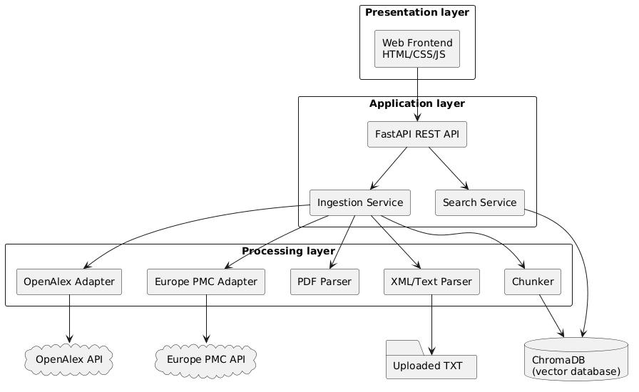
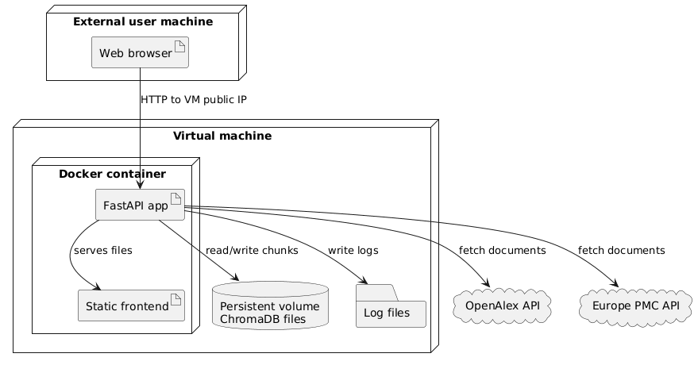

# Mini Semantic Search - Igor Zawada, Jakub Miszczak

## Local run

```powershell
python -m venv .venv
.\.venv\Scripts\python -m pip install --upgrade pip
.\.venv\Scripts\python -m pip install -r requirements.txt
.\.venv\Scripts\uvicorn app.main:app --host 0.0.0.0 --port 8000 --reload
```
UI: http://127.0.0.1:8000/

open:

- `http://127.0.0.1:8000`
- `http://127.0.0.1:8000/docs`

## Docker dev

```powershell
docker compose -f docker-compose.dev.yml up --build
```

## Docker / VM

```powershell
docker compose -f docker-compose.prod.yml up --build -d
```

open:

- `http://<vm_ip>:8000`
- `http://<vm_ip>:8000/docs`

## Demo data

```powershell
.\.venv\Scripts\python scripts\load_demo_data.py
```

## Testing

(środowisko `.venv` aktywne)

**1. Testy jednostkowe (Unit Tests):**
```powershell
.\.venv\Scripts\python -m pytest
```

**2. Testy wydajnościowe (Performance Tests):**
Serwer musi działać w tle. W nowym terminalu:
```powershell
.\.venv\Scripts\python tests/performance_test.py
```

## Architektura i Uzasadnienie Wyboru Komponentów

System opiera się na architekturze warstwowej, co pozwala na czytelny podział obowiązków w kodzie. Technologie dobraliśmy tak, żeby całość działała szybko, stabilnie i sprawnie obsługiwała obróbkę wektorową tekstów:

* **FastAPI (Backend i API):** Wybraliśmy ten framework ze względu na jego wysoką wydajność i wbudowaną obsługę asynchroniczności. Gdy aplikacja musi równolegle pobierać dane z różnych miejsc (jak OpenAlex czy Europe PMC), nie blokuje przy tym działania serwera. Dużym plusem jest też to, że interaktywna dokumentacja API (Swagger UI) generuje się tu automatycznie.
* **ChromaDB (Baza Danych):** Stworzyliśmy wektorową baza danych, która jest najlepsza do wyszukiwania semantycznego (szukania po znaczeniu, a nie tylko po słowach). Wybraliśmy ją, bo działa jako lekka baza plikowa. Podpieliśmy ją pod stały wolumen (Persistent volume) w Dockerze, dzięki temu pobrane dokumenty i wektory są bezpieczne i nie znikają po wyłączeniu czy restarcie aplikacji.
* **Docker i Docker Compose (Środowisko Uruchomieniowe):** Użyliśmy dwóch osobnych konfiguracji – deweloperskiej (do pisania kodu z podglądem na żywo) i produkcyjnej (do odpalenia na serwerze/VM). Dzięki temu projekt uruchomi się dokładnie tak samo. 
* **Pytest i HTTPX (Testy):** Chcieliśmy zadbać o stabilność bez instalowania ciężkich i skomplikowanych narzędzi, więc skorzystaliśmy z bibliotek `pytest` do testów jednostkowym oraz `httpx` do napisania skryptu dla testów wydajnościowych.


### Diagram Komponentów


### Diagram Wdrożeniowy (Deployment)



### Podział pracy:
| Członek zespołu | Zrealizowane zadania |
| :--- | :--- |
| **Igor Zawada** | FastAPI, integracja ChromaDB, logika biznesowa (wyszukiwanie, wektoryzacja), adaptery danych (OpenAlex, Europe PMC), konteneryzacja (Docker dev/prod) |
| **Jakub Miszczak** | FastAPI, logika biznesowa (pobieranie, chunking), testy jednostkowe (pytest), testy wydajnościowe (httpx), diagramy UML, dokumentacja |
